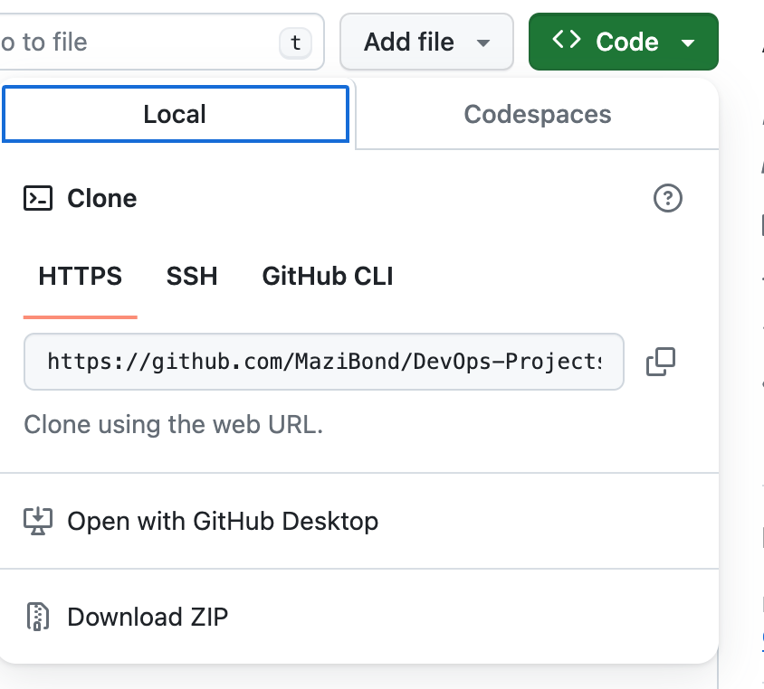

# Introduction:

This basic Git project represents a starting point for my journey into Git.This is a walkthrough on the essential steps of setting up a Git project and introduction of fundamental concepts that will enable a DevOPs engineer to work efficiently and collaborate seamlessly.

## Key Steps in Creating a Basic Git Project:

## Initialising and making commits

### 1. Initializing a Git Repository:
The first step is to initialize a Git repository in your project folder. Open your terminal or command prompt, navigate to your project directory, and run the following command:
```Bash
git init
```

This command sets up a new Git repository, creating a hidden .git folder to store the configuration and version history.

### 2. Adding and Committing Files:
After initializing the repository, start by adding your project files to Git's tracking system. Use the following commands to stage and commit your files:

```Bash
git add .
```


```Bash
git commit -m "Initial commit"
```

The git add . command stages all changes, and git commit -m "Initial commit" commits the changes with a descriptive message.

## Working with branches
Understanding how to create, manage, and merge branches is fundamental to efficient and organized development. This guide, will delve into the essential concepts of working with branches in Git and explore how they contribute to a more flexible and collaborative coding environment.

### 1. Creating a New Branch:

Branch creation marks the beginning of a focused development effort. To create a new branch, use the following command:

```Bash
git branch new_feature
```
Alternatively, combine branch creation and switching into one step with the -b option:
```Bash
git checkout -b new_feature
```
or
```Bash
git switch -c new-feature
```

This creates a new branch named "new_feature" and switches to it, providing an isolated workspace for your changes.

### 2. Listing Local Branches:
To see a list of branches on your local machine, use:

```Bash
git branch
```

This command will display all local branches, and the currently active branch will be highlighted with an asterisk (*).

### 3. Making Changes and Committing:

With changes isolated in a branch, you can now make modifications to your code. After making changes, stage and commit them:

```Bash
git add .
```


This stages all the changes in the branch.
```Bash
git commit -m "Implement new feature"
```


These changes are confined to the current branch, preventing interference with other ongoing development efforts.

### 4. changing into old branch

```Bash
git checkout main
```

### 5. Merging Branches:

Integration of changes from a feature branch back into the main branch is a critical step. Switch to the target branch and use the git merge command:

```Bash
git checkout main
git merge new_feature
```
This integrates the changes from "new_feature" into the main branch. Resolving any conflicts that may arise ensures a smooth merge.

### 5. Deleting Branches:

To maintain a tidy repository, removde branches that have served their purpose. Locally, use the following command:

```Bash
git branch -d new_feature
```
For branches pushed to a remote repository, use:

# Collaboration and Remote Repository
This guide presupposes that a Git hub account has been setup already.

## Link the Local Repository to the GitHub Repository:
### 1. Adding Remote Repository
- Copy the Remote Repository URL:
If you don't have the URL of the remote repository, you can usually find it on the GitHub or GitLab website. It will look something like:
```bash
HTTPS: https://github.com/username/repository.git
```

- Navigate to Your Local Repository:
Open a terminal or command prompt and navigate to your local Git repository using the cd command:

```Bash
cd /Documents/repository
```

- Add the Remote Repository:
Use the git remote add command to add a remote repository. Replace origin with the name you want to give to the remote (it's a common convention to use "origin") and replace the URL with the actual URL of your remote repository:

```Bash
git remote add origin https://github.com/username/repository.git
```


