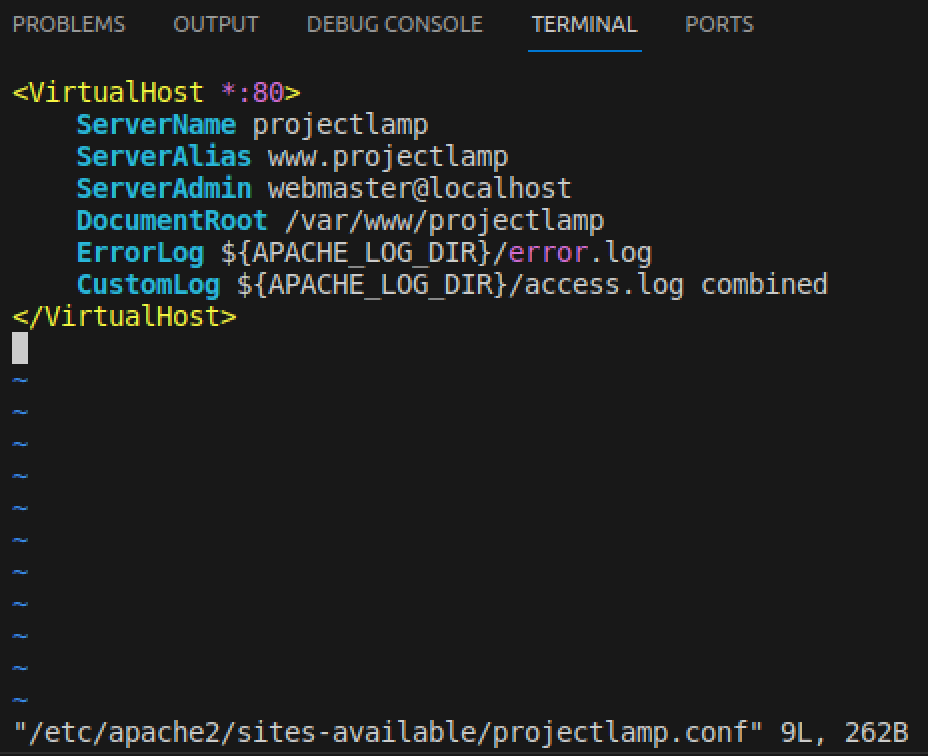

# LAMP Stack Implementation
Implementing a LAMP (Linux, Apache, MySQL, PHP) stack project involves several steps. Below is a general guide to help you set up a basic LAMP environment.

## Pre-requistites Launching a AWS EC2 instance 
It is necessary that an AWS EC2 instance is setup and launched.

### 1. lauching an EC2 instance


### 2. Successful running an EC2 instance
Reloadpage to  ensure the instance is running 


### 3. Connect the EC2 instance using SSH
locate the private key and change the administrative access.
```Bash
chmod 600 /path/to/your/key.pem
```


## install Apache2
### 1. Updagrade and update the package.

```Bash
sudo upgrade && sudo update
```
```Bash
sudo apt install apache2 
```


### 2. check apache status

```Bash
sudo systemctl status apache
```


### 3. Check Apache server connection to public server

```Bash
curl http://localhost:80
```

```Bash
http://<AWS public ip address>
```


## Installation of MySQL
### 1. install the Mysql package using the commandbelow:

```Bash
$ sudo apt install mysql-server
```


### 2. Configure the Mysql 
Run :
```Bash
sudo mysql
```


change root user password by adding to the script

```Bash
ALTER USER 'root'@'localhost' IDENTIFIED WITH mysql_native_password BY 'PassWord.1';
```
### 3. Continue configuring Mysql
Run:
```Bash
$ sudo mysql_secure_installation
```


Anwser accordingly and set strength of password to strong

### 4. Test the configuration 
Run :
```Bash
$ sudo mysql -p
```


and exit

## Installing PHP
### 1. Install PHP
Run:
```Bash
 sudo apt install php libapache2-mod-php php-mysql
```


## Enable PHP on Website

### 1. configure the ect to ensure the system priorities the PHP index file.
Run:
```Bash
sudo vim /etc/apache2/mods-enabled/dir.conf
```
- add this


```Bash
<IfModule mod_dir.c>
        DirectoryIndex index.php index.html index.cgi index.pl index.xhtml index.htm
</IfModule>
```

- Reload the server by running:


```Bash
sudo systemctl reload apache2
```
### 2. Create an  index file:

```Bash
vim /var/www/projectlamp/index.php
```
- write this:

```Bash
<?php
phpinfo();
```


- Check the browser through the public ip address/index.php:


##  Creating a virtual Host for website using APache

### 1. Create a project file
- Run this:

```Bash
sudo mkdir /var/www/projectlamp
```

- Check file using "tree" command:

```Bash
tree
```


### 2. Assign ownership to the directory

```Bash
sudo chown -R $USER:$USER /var/www/projectlamp
```

### 3. Configure the Apache's sites-available directory 

Run:

```Bash
sudo vi /etc/apache2/sites-available/projectlamp.conf
```

Add:

```Bash
<VirtualHost *:80>
    ServerName projectlamp
    ServerAlias www.projectlamp 
    ServerAdmin webmaster@localhost
    DocumentRoot /var/www/projectlamp
    ErrorLog ${APACHE_LOG_DIR}/error.log
    CustomLog ${APACHE_LOG_DIR}/access.log combined
</VirtualHost>
```




### 4. Enable the New virtual host

Run:

```Bash
 sudo a2ensite projectlamp
```
and Run the command below to disable apache default website

```Bash
 sudo a2dissite 000-default
```

### 5. Test the syntax for syntax errors
Run:

```Bash
 sudo apache2ctl configtest
```


### 6. Reload the Apache
Run :
```Bash
sudo systemctl reload apache2
```

### 7. Test the website
- Check the website using the public ip address


