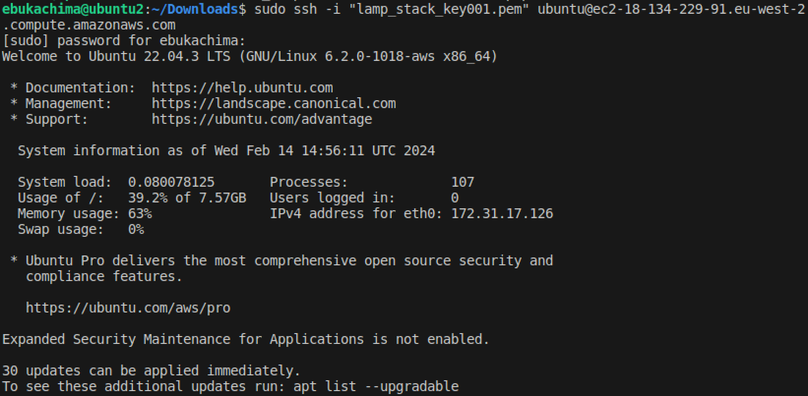
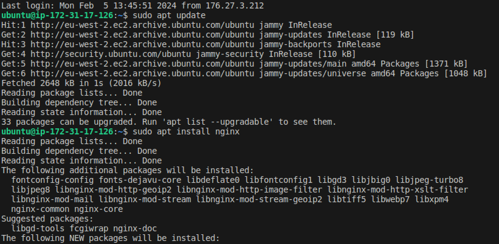
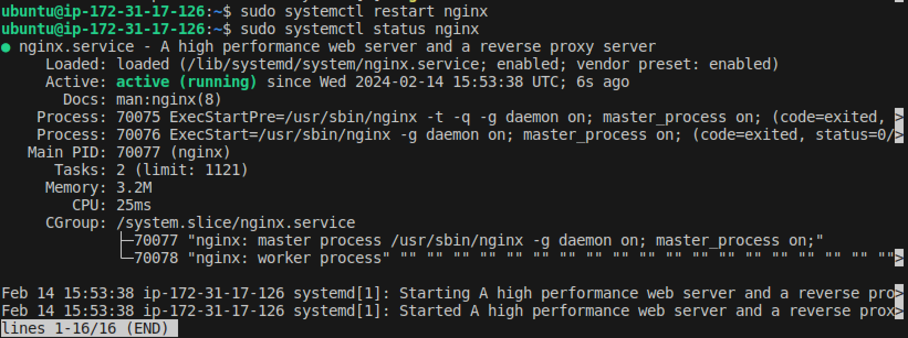
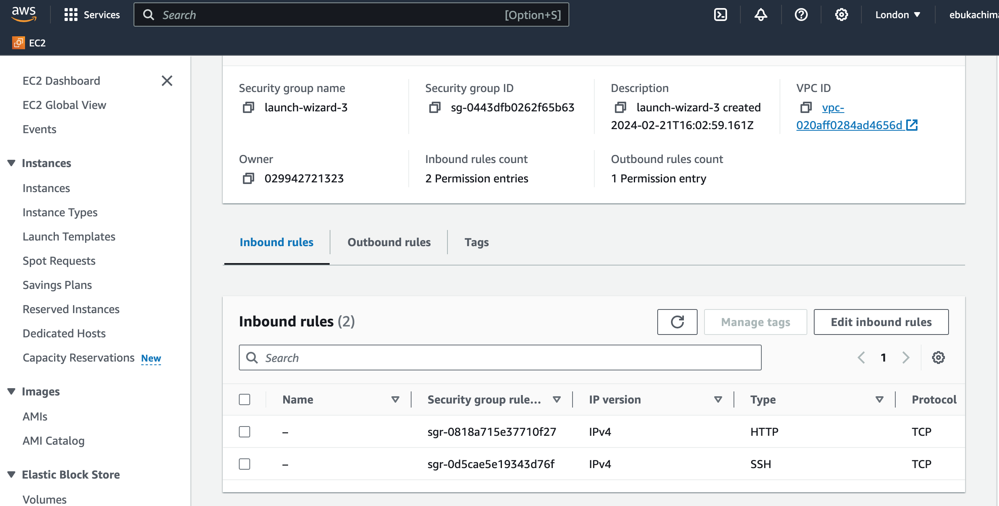
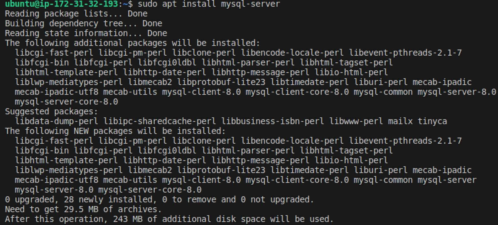
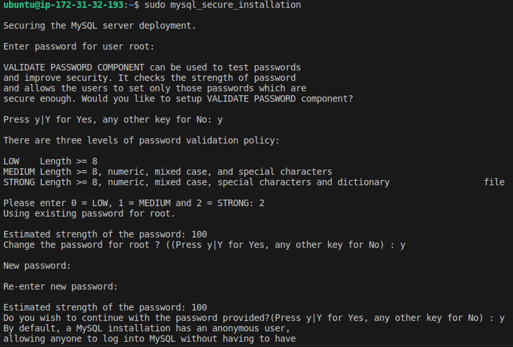
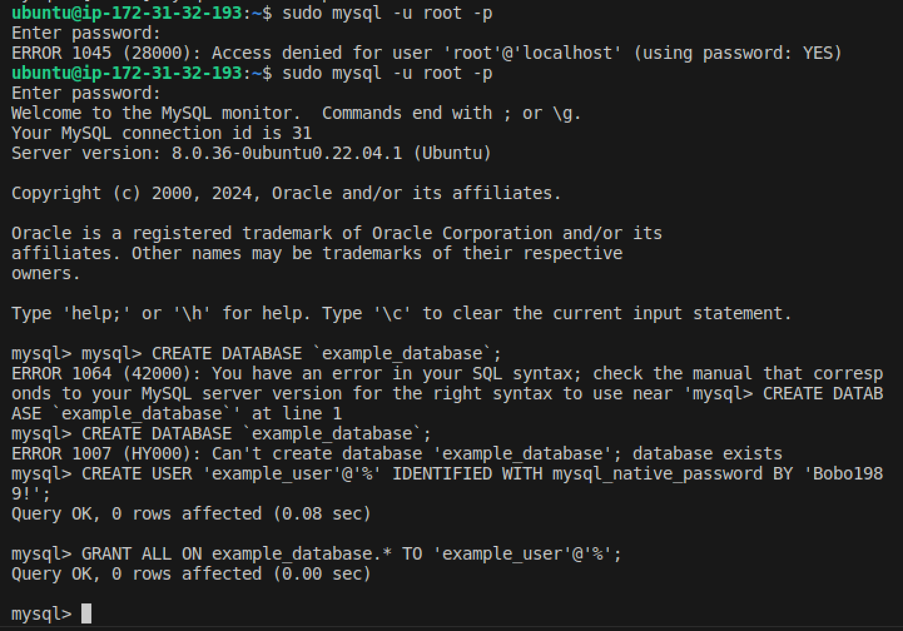
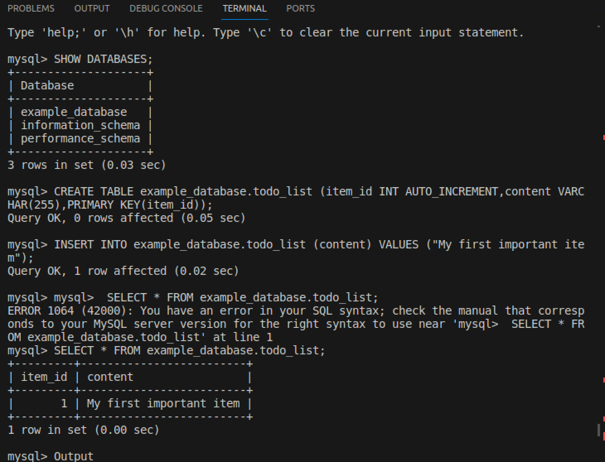
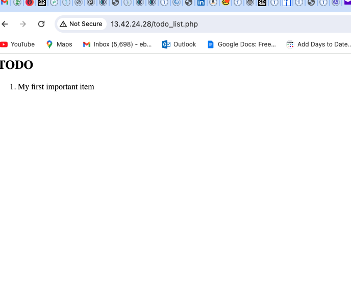

# Webs Stack Implementation
Implementing a Web Stack project involves several steps. Below is a general guide to help you set up a basic LAMP environment.

## Pre-requistites Launching a AWS EC2 instance 
It is necessary that an AWS EC2 instance is setup and launched.

### 1. Connect with the EC2 instance

Run: 
```Bash
ssh -i "lamp_stack_key001.pem" ubuntu@ec2-18-134-229-91.eu-west-2.compute.amazonaws.com
```

## Installation of NGINX 
**Nginx** is a popular open-source web server software known for its high performance, reliability, and scalability.Nginx has since gained widespread adoption as a versatile web server and reverse proxy.

### 1. Upgrade the ubuntu operating System and install **nginx**

- Run the following command:

```Bash
sudo apt update 
sudo apt install nginx
```
This updates all the packages and their dependencies before the installation of the **nginx** server.


- Check whether it was successfully installed and active with the command below:

```Bash
sudo systemctl status nginx
```


- Configure the inbound rules of security group to ensure that that port 80 is enabled to allow for the public IP address to be found.



- copy and paste the public IPaddress of the EC2 instance in the Chrome browser.

```Bash
http://<Public-IP-Address>:80
```


### 2. Installing **Mysql**
- Enter the following command and enter **Y** when promted to install the MySql database:

```Bash
sudo apt install mysql-server
```


- Configure the Mysql by running the following command:
```Bash
sudo mysql
```
This gives one access to the mysql server as a root administrative user. Therein, paste the following scrip
```Bash
ALTER USER 'root'@'localhost' IDENTIFIED WITH mysql_native_password BY 'PassWord.1';
```
This sets the root user password as 'PassWord.1' then exit.


- After setting the root user password, run a security script provided by MySQL to enhance the security of your installation:
```Bash
sudo mysql_secure_installation
```
This script will guide you through several security options, such as setting a root password, removing anonymous users, disallowing remote root login, and removing test databases. Follow the prompts and answer 'Y' (yes) or 'N' (no) as appropriate.



### 3. Installing PHP
- Run the following command:

```Bash
sudo apt install php-fpm php-mysql
```
This command specifically installs PHP-FPM, which is used for processing PHP code, and the PHP MySQL extension, allowing PHP to interact with MySQL databases.


### 4. Configring Nginx to use PHP processor

We have to configure the Nginx web server to host projectLEMP  (dormain name) on the server. Instead of modifying  ``` /var/www/html ``` , we will create a file withing ```/var/www```  for the dormain website.

- to create this, enter the following command:


```bash
sudo mkdir /var/www/projectLEMP
```
- This creates the directry projectLEMP

```Bash
sudo chown -R $USER:$USER /var/www/projectLEMP
```
This modifies the ownership of the directry by making the default $USER the owner.

- Open a new configuration file in Nginx's ```sites-available``` directory using the command below:
```Bash
sudo nano /etc/nginx/sites-available/projectLEMP
```
This command creates a blank file, opens same and makes it editable.
- Paste the following cnfigration therein ;
```
#/etc/nginx/sites-available/projectLEMP

server {
    listen 80;
    server_name projectLEMP www.projectLEMP;
    root /var/www/projectLEMP;

    index index.html index.htm index.php;

    location / {
        try_files $uri $uri/ =404;
    }

    location ~ \.php$ {
        include snippets/fastcgi-php.conf;
        fastcgi_pass unix:/var/run/php/php8.1-fpm.sock;
     }

    location ~ /\.ht {
        deny all;
    }

}

```


## See below the breakdown of the configration:


- server {: This line begins the configuration block for a virtual server in Nginx. Everything within this block applies to requests for this server.

- listen 80;: This line specifies that Nginx should listen for HTTP requests on port 80. Port 80 is the default port for HTTP traffic.

- server_name projectLEMP www.projectLEMP;: This line sets the server names for which this server block will be invoked. In this case, it will respond to requests for projectLEMP and www.projectLEMP.

- root /var/www/projectLEMP;: This line sets the document root directory for this server block. Requests for resources will be served from this directory.

- index index.html index.htm index.php;: This line specifies the order in which index files are prioritized when a directory is requested. If a directory is requested, Nginx will look for these files in the specified order and serve the first one it finds.

- location / {: This line defines a location block for requests to the root directory ("/"). This block specifies how Nginx should handle requests for resources located at the root.

- try_files $uri $uri/ =404;: This line tells Nginx to try to serve the requested file. If the file is not found, it will try to serve the request as a directory. If neither is found, it will return a 404 Not Found error.

- location ~ \.php$ {: This line defines a location block for requests ending in ".php". This block specifies how Nginx should handle PHP files.

- include snippets/fastcgi-php.conf;: This line includes another configuration file (fastcgi-php.conf) which contains settings related to FastCGI PHP processing.

- fastcgi_pass unix:/var/run/php/php8.1-fpm.sock;: This line specifies the FastCGI backend server to which PHP requests should be passed. In this case, it's passing requests to a Unix socket (php8.1-fpm.sock).

- location ~ /\.ht {: This line defines a location block for requests containing ".ht" in the URI. This block specifies how Nginx should handle requests for Apache .htaccess files.

- deny all;: This line denies all requests matching the location block, effectively preventing access to any files or directories with names containing ".ht".


- ### Activate the above cnfigration

- enter the following commands:

```Bash
sudo ln -s /etc/nginx/sites-available/projectLEMP /etc/nginx/sites-enabled/
```
The command below checks for syntax error
```Bash
sudo nginx -t
```


- unlink the default Nginx host , Run:

```Bash
sudo unlink /etc/nginx/sites-enabled/default

```

- The reload the Nginx server:
```Bash
sudo systemctl reload nginx

```

- create a php index page as landing page for the website by rnning the follwing command:

```Bash
sudo touch /var/www/projectLEMP/index.php
```

- Now go to the browser and enter the pblic ip address:

```Bash
http://<Public-DNS-Name>:80
```


## Testing the PHP with Nginx

- To test the PHP with the server, run the following command to open the PHP file:
```Bash
vim /var/www/projectLEMP/index.php

```

- paste the following PHP script;

```
<?php
phpinfo();
```
when you refresh the puublic IP address it will display the PHP information page like the page below.


After checking the relevant information about the PHP server through the page,  it is recommended that the file be removed as it contains sensitive information.

- Run the following command to remove file:

```Bash
sudo rm /var/www/your_domain/info.php
```

- ## Retrieving Data from MySQL database with PHP

In this step we will create a test database with a simple "To-do list"  and configure access to it, so that the Nginx website would be able to query data from the DB.

- Connect the MySQL console using the root account:
This command allows you to enter the root users password in other to edit the server
```Bash
sudo mysql -u root -p
```
- create a new user ``` example_user``` and assign the password ```PassWord.1``` (use your prefered strong password) with this commmand:

```Bash
CREATE USER 'example_user'@'%' IDENTIFIED WITH mysql_native_password BY 'PassWord.1';
```

- Grant the newly created user the permission to the database with this command:

```Bash
GRANT ALL ON example_database.* TO 'example_user'@'%';

```
- exit the database


- you can test the configuration with the command :
This code gives the root user access 
```Bash
sudo mysql -u example_user -p
```
The ```-u``` flag identifies the user while the ```-p``` flag prompts the user to enter the password.

- After logging into the Mysql database enter the following query:

```Bash
CREATE TABLE example_database.todo_list (item_id INT AUTO_INCREMENT,content VARCHAR(255),PRIMARY KEY(item_id));

```
This creates a testtable named todo_list.

- Enter the fllowing command to insert rows of content.

```Bash
INSERT INTO example_database.todo_list (content) VALUES ("My first important item");
```
- enter the following query to confirm that it is applied:

```Bash
SELECT * FROM example_database.todo_list;
```


- Now create a PHP script that will connect to the Mysql DB and query for your content. Enter the following command to create the new PHP file in the custom root directory.

```Bash
vi /var/www/projectLEMP/todo_list.php

```
- add the following script:

```Bash
<?php
$user = "example_user";
$password = "PassWord.1";
$database = "example_database";
$table = "todo_list";

try {
  $db = new PDO("mysql:host=localhost;dbname=$database", $user, $password);
  echo "<h2>TODO</h2><ol>";
  foreach($db->query("SELECT content FROM $table") as $row) {
    echo "<li>" . $row['content'] . "</li>";
  }
  echo "</ol>";
} catch (PDOException $e) {
    print "Error!: " . $e->getMessage() . "<br/>";
    die();
}

```

save and close the file.

- check whether the configuration is working by visiting the public IP address/todo_list.php as written below:

```Bash
http://<Public_domain_or_IP>/todo_list.php
```

