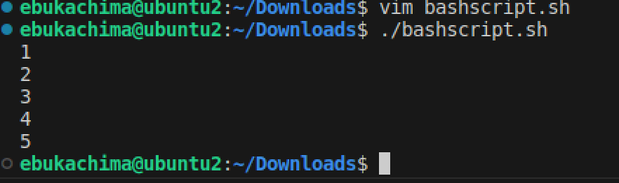
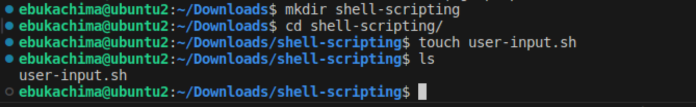

# Shell Scripting Project
## Introduction
Welcome to the Shell scripting project! In this project, we aim to streamline and automate various tasks using shell scripting. Shell scripting is a powerful tool that allows us to write scripts to automate repetitive tasks, manage system configurations, and perform various other functions within a Unix-like operating system.

## Variables in Shell Scripting
In shell scripting, variables are used to store data or values that can be referenced and manipulated throughout the script. They serve as placeholders for storing information such as strings, numbers, file paths, and more. Variables provide flexibility and allow scripts to adapt dynamically to different situations.

## Variable Naming Convention:
- Variable names are case-sensitive and can consist of letters, digits, and underscores.
- They must start with a letter or an underscore.
- Avoid using special characters or reserved keywords to prevent unexpected behavior.
## Variable Assignment:
Variables are assigned values using the = operator. No spaces should be used around the = sign

```bash
variable_name=value
```
## Types of Variables:

## 1.Local Variables:
- Local variables are declared and used within the scope of a shell script or a function.
- They are not accessible outside their defined scope.
```bash
# Declare and assign a local variable
my_var="Hello, world!"
```
## 2. Environment Variables:
- Environment variables are available to all processes spawned by the shell.
- They are typically used to store system-wide configuration settings or user preference.

```bash
# Set an environment variable
export PATH="/usr/local/bin:$PATH"
```
## Accessing Variables:
Variables are accessed by prefixing their names with the $ symbol.

```bash
# Accessing the value of a variable
echo "Value of my_var: $NAME"

```


## Control Flow in Shell Scripting
Control flow structures in shell scripting allow you to make decisions, repeat actions, and control the flow of execution based on conditions. These constructs enable you to create dynamic and flexible scripts that can handle various scenarios.

## 1. Conditional Statements:
- if-then-else:
Allows you to execute different code blocks based on the evaluation of a condition.

```bash
if [ condition ]; then
    # Code block to execute if condition is true
else
    # Code block to execute if condition is false
fi
```
```bash
#!/bin/bash

# Example script to check if a number is positive, negative, or zero

read -p "Enter a number: " num

if [ $num -gt 0 ]; then
    echo "The number is positive."
elif [ $num -lt 0 ]; then
    echo "The number is negative."
else
    echo "The number is zero."
fi
```

This Bash script takes a number as input from the user, then checks whether the number is positive, negative, or zero, and prints the result accordingly.


- for loop:
Executes a series of commands for each item in a list or range.
```bash
for item in list; do
    # Commands to execute for each item
done
```

```bash
#!/bin/bash

# Example script to print numbers from 1 to 5 using a for loop

for (( i=1; i<=5; i++ ))
do
    echo $i
done
```


## 2. Command Substitution
Command substitution in shell scripting allows you to execute a command and use its output as part of another command or assign it to a variable. There are two primary ways to perform command substitution in shell scripts: using backticks (`) or using the $() syntax. Here's an explanation of each method:

Example of command substitution using backtick.

```bash
variable=`command`
```
Example of command substitution using $() syntax

```bash
variable=$(command)
```


## 3. Input and Output
Input and output operations are crucial aspects of shell scripting, enabling interaction with users, reading data from external sources, and displaying information to the user. 
- Example of using the script to accept user input.


output


- Example passing the result of a command into a file:

```bash
echo "hello world" > index.txt
```


- Example passing the content of a file as  input to a command:

```bash
grep "pattern" < input.txt
```

- Example passing the result of a command as input to another command:
```bash
echo "hello world" | grep "pattern"
```
## 4. Functions
Functions in shell scripting allow you to encapsulate reusable blocks of code, enhancing modularity, readability, and maintainability of your scripts. They enable you to define named blocks of code that can be executed multiple times with different inputs. Here's a guide to using functions in shell scripting:

### Defining Functions:
Functions in shell scripting are defined using the following syntax:

```bash
function_name() {
    # Function body
    # Commands to be executed
}
```
A pratical usage of a funtion in shell scripting below:

```bash
#!/bin/bash

# Define a function to greet the user
greet() {
    echo "Hello, $1! Nice to meet you."
}

# Call the greet function and pass the name as an argument
greet "John"
```
## Our First SHell Script (User Input Script)
- Create a folder called shell-scripting to hold all the scripts in this lesson.
runn the command below:

```bash
mkdir shell-sripting
```
- Create a file called user-input.sh using the command below

```bash
touch user-input.sh
```
- paste the following block of code inside the file:

```bash
#!/bin/bash

# Prompt the user for their name
echo "Enter your name:"
read name

# Display a greeting with the entered name
echo "Hello, $name! Nice to meet you."

```



- use vim to write into the file and save.
- Make the file executeable by running the following command:

```bash
sudo chmod +x user-input.sh
```

- Run the script using the following command:

```bash
./user-input.sh
```


## Directory Manipulation and Navigation Script
We will follow a similar pattern to write a simple shell script. The script will  display  the current  diretory,  create a new   directory called "my_directory", create two files inside it, list the files, move back one level up, remove the "my_directory" and its contnts, and finally list the files in the current directory again.

- open a file named "navigating-linux-filesystem.sh"
- paste the code block below into the file.

```bash

#!/bin/bash

# Display current directory
echo "Current directory: $PWD"

# Create a new directory
echo "Creating a new directory..."
mkdir my_directory
echo "New directory created."

# Change to the new directory
echo "Changing to the new directory..."
cd my_directory
echo "Current directory: $PWD"

# Create some files
echo "Creating files..."
touch file1.txt
touch file2.txt
echo "Files created."

# List the files in the current directory
echo "Files in the current directory:"
ls

# Move one level up
echo "Moving one level up..."
cd ..
echo "Current directory: $PWD"

# Remove the new directory and its contents
echo "Removing the new directory..."
rm -rf my_directory
echo "Directory removed."

# List the files in the current directory again
echo "Files in the current directory:"
ls
```


- Run the command below:
```bash
sudo chmod +x navigating-linux-filesystem.sh
```

- Run the sript using the command below:

```bash
./navigating-linux-filesystem.sh
```


## File Operations and Sorting
We will follow a similar pattern to write a simple shell script. The script will  create three (3) files, display the files in their current  order, sort them alphabetically, save the sorted files in sorted_files.txt, display the sorted fils, remove the original files, rename th sortd file to "sortd_file_sorted_alphabetially.txt", and finally display the content of the final sortd file..

- create a file named "sorting.sh"
- paste the code block below into the file.

```bash
#!/bin/bash

# Create three files
echo "Creating files..."
echo "This is file3." > file3.txt
echo "This is file1." > file1.txt
echo "This is file2." > file2.txt
echo "Files created."

# Display the files in their current order
echo "Files in their current order:"
ls

# Sort the files alphabetically
echo "Sorting files alphabetically..."
ls | sort > sorted_files.txt
echo "Files sorted."

# Display the sorted files
echo "Sorted files:"
cat sorted_files.txt

# Remove the original files
echo "Removing original files..."
rm file1.txt file2.txt file3.txt
echo "Original files removed."

# Rename the sorted file to a more descriptive name
echo "Renaming sorted file..."
mv sorted_files.txt sorted_files_sorted_alphabetically.txt
echo "File renamed."

# Display the final sorted file
echo "Final sorted file:"
cat sorted_files_sorted_alphabetically.txt

```

- Set execute permission on sorting.sh using the command below:

```bash
sudo chmod +x sorting.sh
```

- Run the the script with the following command:

```bash
./sorting.sh
```


## Arithimetic Script
This sript defines two (2) variables num1 and num2 with numri values, performs basic arithimetic operation and displays th result. It also performs more omplex calulations like raising num1 to the power of 2 and alculating the square root of num2 and displaying thir result.

- create a file alled "calculations.sh" using the command below:

```bash
touch calculations.sh
```

- copy and paste the block of code below into the file:

```bash
#!/bin/bash

# Define two variables with numeric values
num1=10
num2=5

# Perform basic arithmetic operations
sum=$((num1 + num2))
difference=$((num1 - num2))
product=$((num1 * num2))
quotient=$((num1 / num2))
remainder=$((num1 % num2))

# Display the results
echo "Number 1: $num1"
echo "Number 2: $num2"
echo "Sum: $sum"
echo "Difference: $difference"
echo "Product: $product"
echo "Quotient: $quotient"
echo "Remainder: $remainder"

# Perform some more complex calculations
power_of_2=$((num1 ** 2))
square_root=$(echo "sqrt($num2)" | bc)

# Display the results
echo "Number 1 raised to the power of 2: $power_of_2"
echo "Square root of number 2: $square_root"
```

- Set execute permission on sorting.sh using the command below:

```bash
sudo chmod +x calculations.sh
```

- Run the the script with the following command:

```bash
./calculations.sh
```


## File Bakup and Timestamping Script
This shell script defines the source dirtory paths. it thn reates a timstamp using the current date and time and creates a backup directory with timestamp appended to its name. The script copies all  files from the source directory to backup directory using the 'cp' command with -r option for  recursive  copying. Finallly, it displays a message indicating the  completion of the  backup process and shows the path of the back up directory  with the timestamp.

- create a file alled "calculations.sh" using the command below:

```bash
touch backup.sh
```

- copy and paste the block of code below into the file:

```bash
#!/bin/bash

# Define the source directory and backup directory
source_dir="/path/to/source_directory"
backup_dir="/path/to/backup_directory"

# Create a timestamp with the current date and time
timestamp=$(date +"%Y%m%d%H%M%S")

# Create a backup directory with the timestamp
backup_dir_with_timestamp="$backup_dir/backup_$timestamp"

# Create the backup directory
mkdir -p "$backup_dir_with_timestamp"

# Copy all files from the source directory to the backup directory
cp -r "$source_dir"/* "$backup_dir_with_timestamp"

# Display a message indicating the backup process is complete
echo "Backup completed. Files copied to: $backup_dir_with_timestamp"
```

- Set execute permission on sorting.sh using the command below:

```bash
sudo chmod +x bakcup.sh
```

- Run the the script with the following command:

```bash
./backup.sh
```


