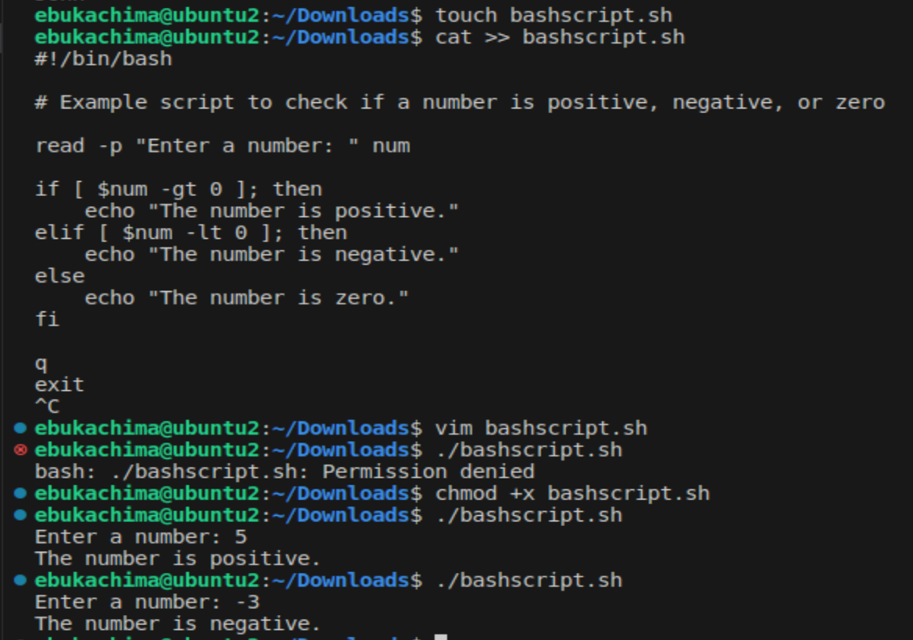

# Shell Scripting Project
## Introduction
Welcome to the Shell scripting project! In this project, we aim to streamline and automate various tasks using shell scripting. Shell scripting is a powerful tool that allows us to write scripts to automate repetitive tasks, manage system configurations, and perform various other functions within a Unix-like operating system.

## Variables in Shell Scripting
In shell scripting, variables are used to store data or values that can be referenced and manipulated throughout the script. They serve as placeholders for storing information such as strings, numbers, file paths, and more. Variables provide flexibility and allow scripts to adapt dynamically to different situations.

## Variable Naming Convention:
- Variable names are case-sensitive and can consist of letters, digits, and underscores.
- They must start with a letter or an underscore.
- Avoid using special characters or reserved keywords to prevent unexpected behavior.
## Variable Assignment:
Variables are assigned values using the = operator. No spaces should be used around the = sign

```bash
variable_name=value
```
## Types of Variables:

## 1.Local Variables:
- Local variables are declared and used within the scope of a shell script or a function.
- They are not accessible outside their defined scope.
```bash
# Declare and assign a local variable
my_var="Hello, world!"
```
## 2. Environment Variables:
- Environment variables are available to all processes spawned by the shell.
- They are typically used to store system-wide configuration settings or user preference.

```bash
# Set an environment variable
export PATH="/usr/local/bin:$PATH"
```
## Accessing Variables:
Variables are accessed by prefixing their names with the $ symbol.

```bash
# Accessing the value of a variable
echo "Value of my_var: $NAME"

```


## Control Flow in Shell Scripting
Control flow structures in shell scripting allow you to make decisions, repeat actions, and control the flow of execution based on conditions. These constructs enable you to create dynamic and flexible scripts that can handle various scenarios.

## 1. Conditional Statements:
- if-then-else:
Allows you to execute different code blocks based on the evaluation of a condition.

```bash
if [ condition ]; then
    # Code block to execute if condition is true
else
    # Code block to execute if condition is false
fi
```
```bash
#!/bin/bash

# Example script to check if a number is positive, negative, or zero

read -p "Enter a number: " num

if [ $num -gt 0 ]; then
    echo "The number is positive."
elif [ $num -lt 0 ]; then
    echo "The number is negative."
else
    echo "The number is zero."
fi
```

This Bash script takes a number as input from the user, then checks whether the number is positive, negative, or zero, and prints the result accordingly.




- case/esac:
Provides a way to match a value against multiple patterns and execute corresponding code blocks.
```bash
case "$variable" in
    pattern1)
        # Code block to execute for pattern1
        ;;
    pattern2)
        # Code block to execute for pattern2
        ;;
    *)
        # Default code block
        ;;
esac

```


