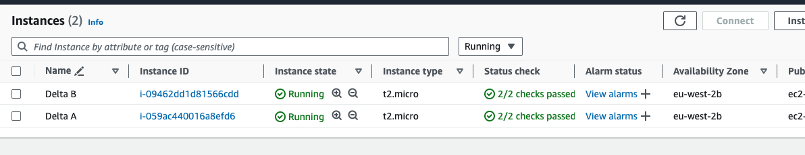

# Client Server Architecture with MySQL Database Managment System
Implementing a client-server architecture with MySQL as the Database Management System (DBMS) involves setting up a MySQL server to store and manage the database, and then developing client applications that interact with the server to perform various database operations. Here's an introduction to how we can implement this architecture:

## 1. Setting up MySQL Server:
### Installation:

- Install MySQL server on a dedicated machine or a cloud instance.
- Install MySQL client on a dedicated machine or a cloud instance.

## 2. Configurations
- Configure MySQL server to listen for remote connections.

## 3. Connecting to MySQL Server:
- Establish a connection to the MySQL server from the client server using MySQL client. Specify the connection parameters (host, port, username, password) required to connect to the MySQL server.


# Implementations
## - Prerequisites
In this project, you will need to create two linux based servrs (E2 instances in AWS).
- Server 1 (Delta A) = mysql server
- Server 2 (Delta B) = mysql client



- connect to the respective instances.
## Delta A

## Delta B


## Installations
1. upgrade and update the OS before any installations on the instances. Run the command below to do this:
```bash
sudo apt update && sudo apt upgrade
```

2. install mysql-server software on Delta A by running the command below:
```bash
sudo apt install mysql-server
```


3. install mysql-client software on Delta B by running the command below:
```bash
sudo apt install mysql-client
```


## Configuration
1. Configure Security Groups on AWS:

Ensure that the security group associated with Delta A allows incoming traffic on port 3306 (MySQL default port) from the security group associated with Delta B.

- Go to the AWS Management Console.
- Navigate to the EC2 Dashboard.
- Select "Security Groups" from the left sidebar.
- Find the security group associated with Delta A.
- Edit the inbound rules to allow traffic on port 3306 from the security group associated with Delta B(Private IP address).


2. Configure MySQL Server on Delta A:

Edit the MySQL server configuration file to allow remote connections. By default, MySQL may only listen for connections on the local loopback interface.
Run the command below:
```bash
sudo vim /etc/mysql/mysql.conf.d/mysqld.cnf
```
- Find the bind-address directive and change its value to 0.0.0.0 to listen on all available network interfaces.


- Save the file and exit the editor. Then, restart the MySQL service for the changes to take effect:

```bash
sudo systemctl restart mysql
```

3. Configure MySQL Server User and Privileges:

Make sure you have a MySQL user account that is allowed to connect remotely from the Linux server. This involves creating a MySQL user with appropriate permissions and privileges for remote access.

- Run the following command on Delta A:

```bash
sudo mysql
```
- paste the following mysql query:

```bash
CREATE USER 'remote_user'@'%' IDENTIFIED BY 'password';
GRANT ALL PRIVILEGES ON *.* TO 'remote_user'@'%';
FLUSH PRIVILEGES;
```


By following these steps, you can configure MySQL server user privileges for remote access. Adjust the privileges according to your specific needs and security considerations.

## Connetion of client server to mysql server
1. Connect from Delta B (MySQL Client) to Delta A (MySQL Server) by running the following command on the MySQL Client server:

```bash
mysql -h ip_address -u username -p
```
-h: Specifies the hostname or IP address of the MySQL server.

-u: Specifies the MySQL username to authenticate as.

-p: Prompts for the MySQL user password.


2. Interact with the MySQL Server:

Once connected, you can interact with the MySQL server using the mysql command-line utility. You can execute SQL queries, manage databases, tables, users, etc.

Run the following command:

```bash
show databases;
```


# Congratulations!!!


